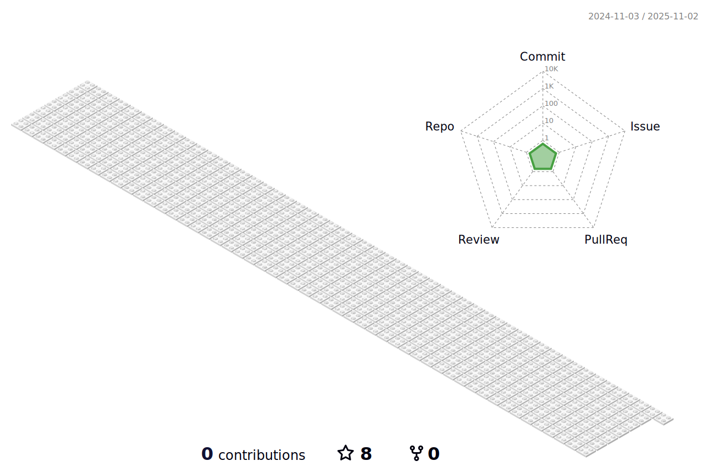

### "Be growing up as a GOOD Developer"
___
### Introduce

  Hi! I intereted in ML, DL, and AI.
   
  Especially among them, My Main is Computer Vision and Natural Language Processing.
   
  I hope developing COOL things with good person.
   
  So, I'll continue to study hard to become a good person too. Thanks!

___

## Main Project

### [1. 취향식탁](https://habitual-nail-f6c.notion.site/ppt-7530468532044e8fa6c70c4c75972b76?pvs=4)
  - ㈜요기요 마케팅 팀 프레젠테이션
  - 리뷰에 대한 키워드 분석
  - 키워드 기반 맛집 추천 서비스
### [2. CatchV](https://www.notion.so/da92758cda7743d09a4b6931a3605e16)
  - **[2022 공개 SW개발자대회 동상(KT ds상) 수상](https://youtu.be/0Ui0ibt0NYQ)**
  - 디지털 성범죄 피해자 지원 오픈소스 프로젝트
  - 다각도 셀카를 입력받아 불법 사이트에 유포된 영상 URL을 반환하는 서비스

## Side/Toy Project
### 공사중

___

## Skill

  
  
  
  
  
  
  
   
  
  
  
  
  
   
  
  
  
  
  
   
  
  
   
  
  
  
  
  

### SNS

  
  
  </a>
  

___

  
    
            

